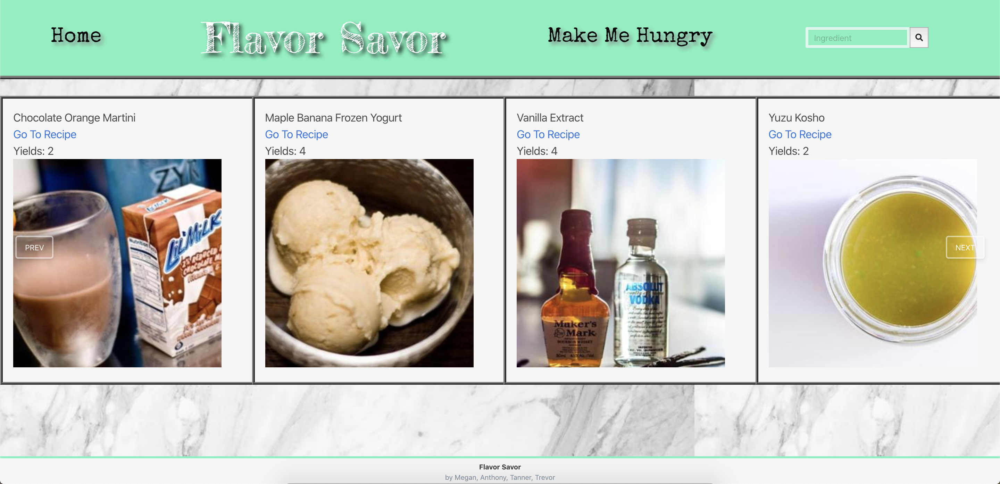

# <strong>Flavor Savor

In this project our team created a web based app called Flavor Savor that finds a recipe based on what food item the user inputs and it displays a number of recipes

 

## <strong> Usage of the App <strong>
* Opens to a display of recipes
* Search a desired ingredient
    * displays desired ingredient recipes
* Click on the Food Giphys tab
    * displays giphys

 

The following image demonstrates the application:

 

## <strong> API'S Used:
* Giphys api
* Edamam api 
*  Third party api:
    * Glider js

 

Find some delicious recipes: [Flavor Savor](https://dorntrevor7.github.io/Flavor-Savor/)

